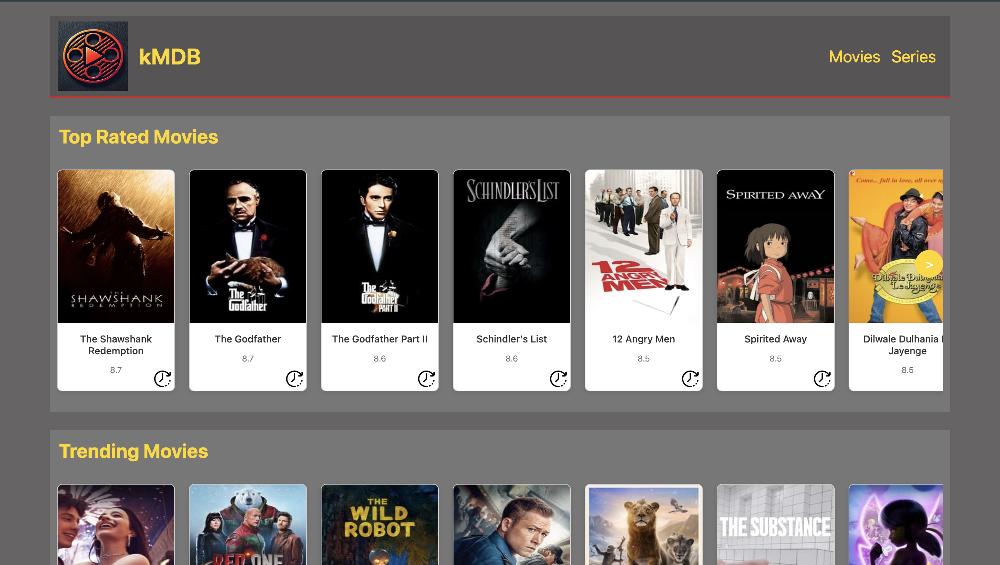
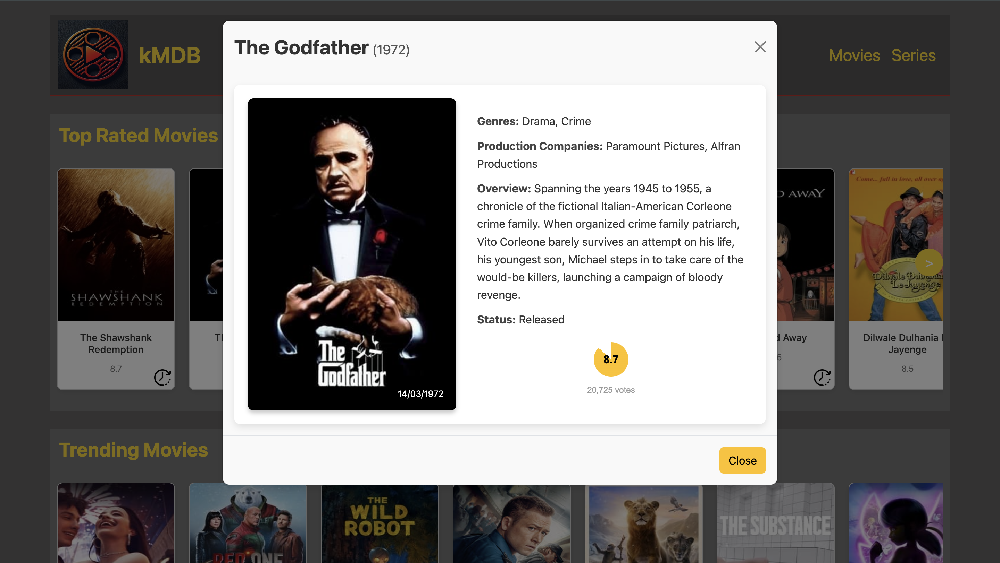
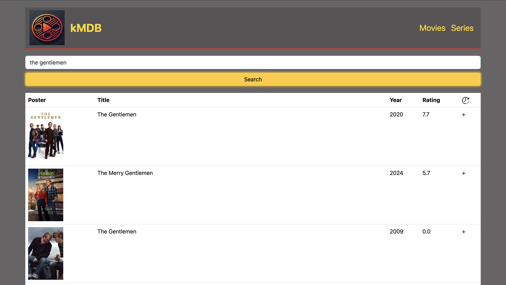
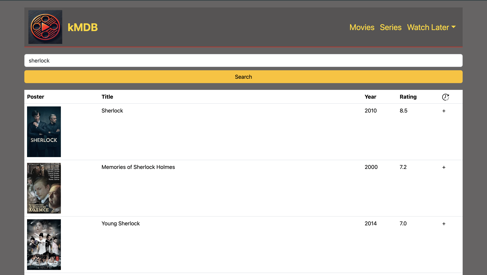
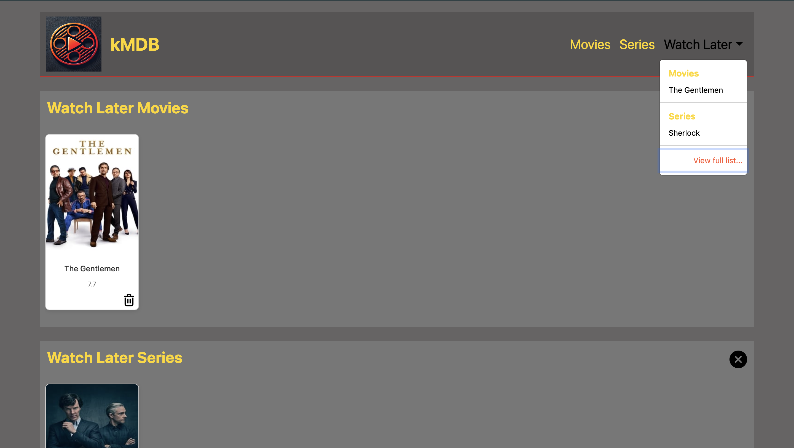

# kMDB

kMDB is a dynamic and user-friendly web application designed to help users discover and explore a wide variety of movies and series. Built with **React**, **Redux Toolkit**, and **RTK Query**, kMDB offers an engaging experience with responsive design and seamless features.

## Features
- 🎬 **Discover Top-Rated Movies & Series**
Browse and explore the highest-rated films and series with ease.
- 🔍 **Smart Search**
Quickly find movies or series with an intuitive search functionality.
- ♾️ **Infinite scrolling**
Enjoy uninterrupted browsing with smooth infinite scroll integration.
- 💾 **"Watch Later" List**
Save your favorite movies and series to a personalized "Watch Later" list using localStorage.
- 📱 **Fully Responsive Design**
A seamless experience across all devices, from desktop to mobile.

## Installation

Follow these steps to set up the project:

1. **Clone the repository**  
   Clone the project to your local machine:
   ```bash
   git clone https://github.com/kagankocman/movieapp.git
   ```

2. **Navigate to the project directory**  
   Change your working directory to the cloned project:
   ```bash
   cd movieapp
   ```

3. **Install dependencies**  
   Install the required packages:
   ```bash
   npm install
   ```

4. **Obtain a TMDB API user token**  
   - Go to the [TMDB API](https://www.themoviedb.org/documentation/api).
   - Create an account or log in if you already have one.
   - Generate a **user access token** by following the instructions provided in the TMDB API documentation.

5. **Create a `.env` file**  
   - In the root directory of the project, create a file named `.env`.
   - Add the following line to the file, replacing `your_token_here` with your TMDB user token:
     ```bash
     REACT_APP_TMDB_TOKEN=your_token_here
     ```

6. **Start the application**  
   Run the following command to start the development server:
   ```bash
   npm start
   ```

Your application should now be up and running at `http://localhost:3000`. Open your browser and explore the features!

## Usage
- When the application starts, you'll be directed to the **"Dashboard"** section.
- Use the infinite scroll feature to load more movies.
- Use the search bar in the top right corner to find specific movies.
- Save your favorite movies to the "Watch Later" list, which is stored in your browser's localStorage.

## Contributing
Contributions are welcome! Please fork the repository and submit a pull request with your changes.

## Screenshots










